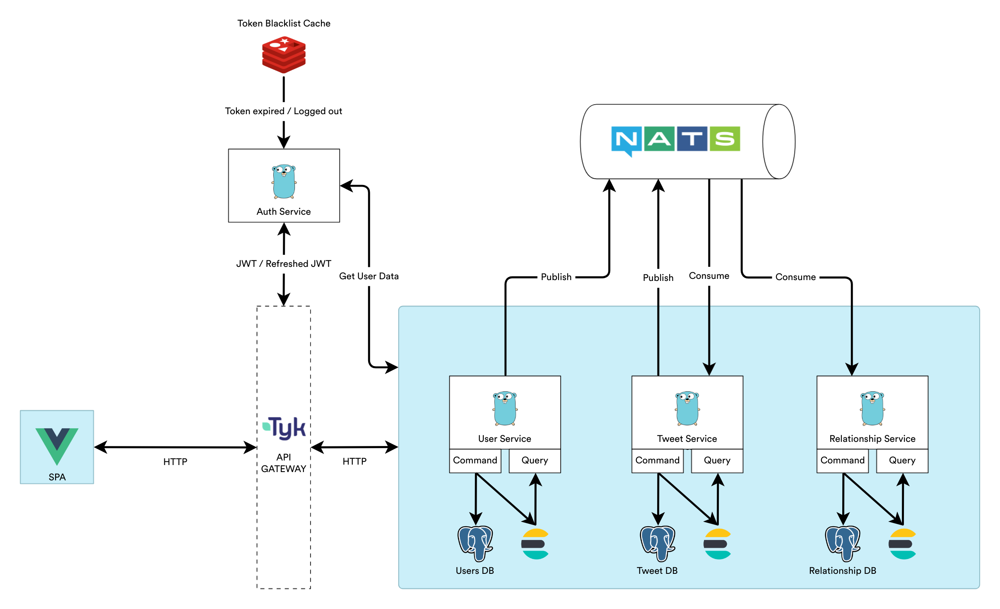

 

  <h3 align="center">Twitter Clone v2</h3>

  
An experimental twitter clone

---

# Disclaimer

twitter-clone is created for educational purposes only.

I am not affiliated with twitter in any way.

# Todo

- [ ] Infrastructure validation
- [ ] User Service
- [ ] Messaging (NATS)
- [ ] Tweet Service
- [ ] Relationship Service
- [ ] Authentication Service
- [ ] API Gateway (Tyk)
- [ ] SPA (Vue)

# Status

Hello, It has been a while since I last updated the twitter clone project. After some time, I decided to do a full rewrite of the project. You may ask **why** I did this. So, the project was getting too big and hard to maintain. Lastly, I've always wanted to dive into microservices and I wanted to see how it would work in practice.

Currently the update is still in early stages. The infrastructure i had it mind at the moment is as follows:

Because I'm learning as I go, I don't want the infrastructure to be overly complex. Next, I'm not sure if I'll be able to deploy it in a production environment because I don't have much experience with microservices yet (and it's probably way out of my budget).

On a side note, I've been very busy with college and other real-life stuff. As a result, the project will most likely take some time to finish.

So, I hope you enjoy the project and I'll be back with updates soon. Thanks for reading!

(BTW, Suggestions are very welcome!)

## Support

If this project is helpful to you, please consider supporting me by donating or just give this project a 🌟

